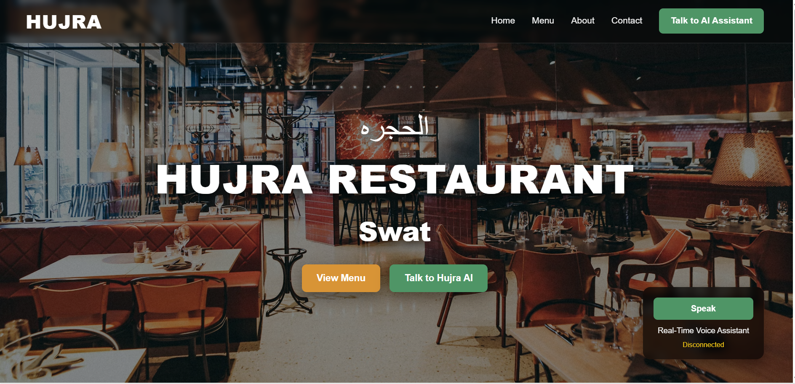

# Hujra Restaurant AI Voice Agent

An AI-powered real-time voice restaurant assistant built using **Gemini Live API**, **FastAPI**, **WebSockets**, and a modern frontend website.

The assistant allows users to talk naturally with an AI restaurant agent for:

- Food ordering
- Menu inquiries
- Order updates
- Order cancellation
- Real-time AI voice conversation

---

# Frontend Preview


---

# Demo Video

[Watch Demo Video](https://reccloud.com/u/av3lpha)
---

# Features

- Real-time AI voice conversation
- Gemini Live API integration
- FastAPI backend with WebSocket support
- Real-time microphone audio streaming
- AI-generated voice responses
- Restaurant menu assistant
- Place food orders using voice
- Modify existing orders
- Cancel orders
- Check order status
- Modern responsive frontend website
- Tool-based AI architecture
- Continuous multi-turn conversation support
- Conversation memory handling
- Detailed debug logging & error handling

---

# Project Structure

```bash
VoiceAgent/
│
├── API/
│   └── voice_api.py
│
├── agents/
│   ├── gemini_client.py
│   ├── prompts.py
│   └── tool_handler.py
│
├── audio/
│   ├── input.py
│   └── output.py
│
├── data/
│   ├── menu.json
│   └── orders.json
│
├── frontend/
│   ├── index.html
│   ├── script.js
│   ├── style.css
│   └── assets/
│       └── frontend-preview.png
│
├── tools/
│   ├── get_menu.py
│   ├── place_order.py
│   ├── update_order.py
│   ├── cancel_order.py
│   └── order_status.py
│
├── utils/
│   ├── validators.py
│   └── file_handler.py
│
├── config.py
├── requirements.txt
├── .env
└── README.md
```

---

# How It Works

## 1. User Speaks

The user speaks through the browser microphone.

---

## 2. Real-Time Audio Streaming

Audio is streamed continuously from the frontend to the FastAPI backend using WebSockets.

---

## 3. Gemini Live API Processing

Gemini Live API processes the audio in real-time and understands the user intent.

Examples:

- Place food order
- Update order
- Cancel order
- Ask menu questions
- Check order status

---

## 4. Tool Execution

The AI automatically calls tools based on the user request.

Available tools:

- `get_menu.py`
- `place_order.py`
- `update_order.py`
- `cancel_order.py`
- `order_status.py`

---

## 5. AI Voice Response

Gemini generates a natural real-time voice response and streams it back to the browser.

---

# Frontend Website

The project now includes a complete frontend website with:

- Restaurant landing page
- AI voice assistant button
- Real-time voice interaction
- WebSocket integration
- Responsive UI design

---

# WebSocket Endpoint

```bash
ws://127.0.0.1:8000/ws/voice
```

---

# Tech Stack

## Backend

- Python
- FastAPI
- WebSockets
- AsyncIO
- Uvicorn

## AI / Voice

- Gemini Live API
- Google GenAI SDK
- Real-time audio streaming

## Frontend

- HTML
- CSS
- JavaScript

## Storage

- JSON-based storage

---

# Installation

## 1. Clone Repository

```bash
git clone https://github.com/your-username/voice-restaurant-agent.git

cd voice-restaurant-agent
```

---

## 2. Create Virtual Environment

### Windows

```bash
python -m venv venv

venv\Scripts\activate
```

### Linux / Mac

```bash
python3 -m venv venv

source venv/bin/activate
```

---

## 3. Install Requirements

```bash
pip install -r requirements.txt
```

---

# Environment Variables

Create a `.env` file:

```env
GEMINI_API_KEY=your_api_key_here
```

Get API key from:

https://aistudio.google.com

---

# Run Backend Server

```bash
uvicorn API.voice_api:app --host 127.0.0.1 --port 8000
```

---

# Run Frontend

Open:

```bash
frontend/index.html
```

Or use Live Server in VS Code.

---

# Example Conversation

## Place Order

### User

> I want one chicken karahi and two naan.

### AI

> Sure! One Chicken Karahi and two Naan added to your order.

---

## Update Order

### User

> Add one cold drink.

### AI

> Done. One Cold Drink added to your order.

---

## Check Bill

### User

> What is my total bill?

### AI

> Your current total bill is Rs. 2020.

---

## Cancel Order

### User

> Cancel my order.

### AI

> Your order has been cancelled successfully.

---

# Conversation Features

The assistant supports:

- Continuous conversation
- Multi-turn interaction
- Natural speech responses
- Context-aware conversation
- Real-time streaming audio
- AI tool calling

---

# Debugging & Logging

The backend includes detailed logs for:

- WebSocket connections
- Audio streaming
- Gemini responses
- Tool execution
- Turn completion
- Error tracebacks
- Session debugging

---

# Important Improvements

## Continuous Real-Time Streaming

Previously:

- Sessions restarted frequently
- Conversation memory was lost
- Second question sometimes failed

Now:

- Stable WebSocket streaming
- Better session handling
- Improved conversation continuity
- Better debugging support

---

## Improved Menu Matching

Examples:

```text
mutton karahi → Mutton Karahi
chicken handi → Chicken Handi
```

---

## Better Order Validation

Supports:

```text
a1
A1
a-1
```

---

## Frontend + Backend Integration

The project now includes:

- Complete frontend website
- FastAPI backend API
- Real-time voice endpoint
- Browser microphone integration

---

# Requirements

```txt
fastapi
uvicorn
google-genai
websockets
pyaudio
python-dotenv
numpy
```

---

# Future Improvements

- Database integration
- User authentication
- Admin dashboard
- React frontend
- Docker deployment
- Multi-language support
- Table reservation system
- Online payments
- WhatsApp ordering
- Cloud deployment

---

# Author

## Adil Hayat

- AI Engineer
- Generative AI Developer
- Voice AI & Agentic Systems Builder

---

# Project Goal

To build a real-time AI-powered restaurant assistant capable of handling natural voice conversations, restaurant operations, and real-time order management using modern AI technologies.
